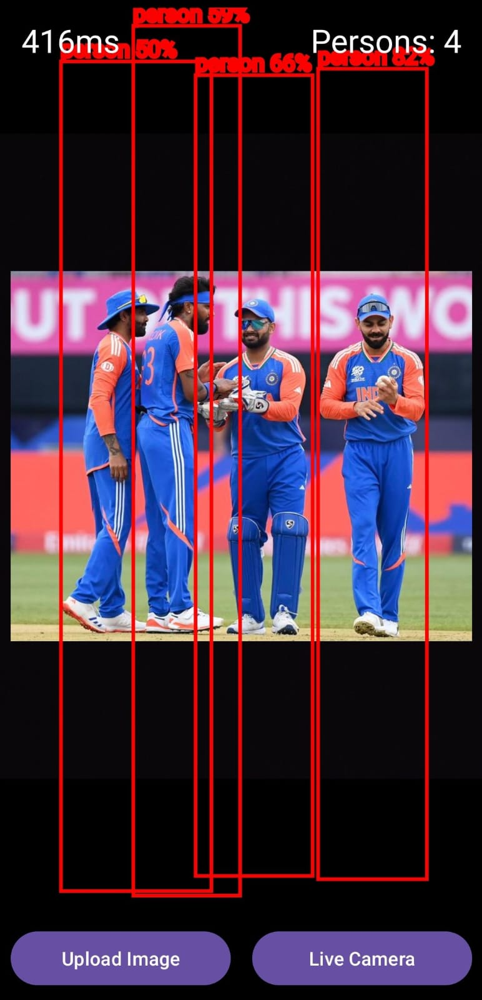

# Person Counting App

This Android app leverages a trained YOLOv8 model, converted to TFLite format, to detect and count people in images or live camera feeds. It's designed for efficient deployment on mobile devices.

## Features

- Detect and count people in static images or real-time camera feeds
- Seamless integration of custom TFLite models and label files
- User-friendly interface for image upload and live camera detection

## Setup Instructions

### Prerequisites

- Android Studio
- A YOLOv8 model trained and converted to TFLite format (.tflite)
- A corresponding label file (.txt)

### Steps to Setup

1. **Clone the Repository**
2. **Add Your Model and Labels**
- Place your `.tflite` model and `.txt` label file in the `assets` folder:
  `app/src/main/assets/`

3. **Update Model and Labels Path**
- Open `Constants.kt` file located at:
  `app/src/main/java/com/detectionapp/yolov8tflite/Constants.kt`
- Update the `MODEL_FILE` and `LABEL_FILE` constants with your file names

4. **Build and Run the App**
- Open the project in Android Studio
- Build the app and run it on an Android device or emulator

## Usage

- **Upload Image**: Select an image from your device to detect and count people
- **Live Camera**: Use the real-time camera feed for continuous people detection and counting

## Screenshots

## Contributing

Contributions are welcome! Please feel free to submit a Pull Request.

## License

This project is licensed under the MIT License - see the [LICENSE](LICENSE) file for details.

## Contact

For any inquiries or issues, please open an issue on the GitHub repository.
